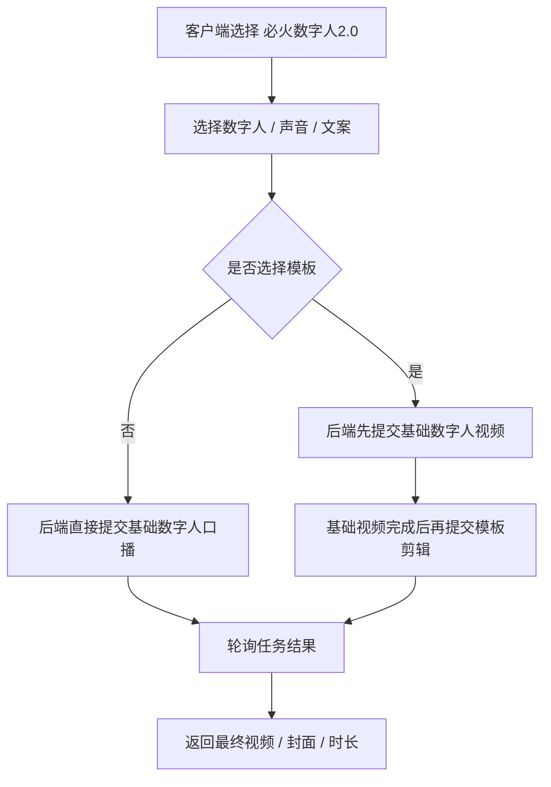

# 必火数字人2.0 接入注意事项

本文档记录“必火数字人2.0”当前在本项目中的完整接入方式，覆盖服务端接口、客户端提交流程、模板混剪链路、素材选择规则和常见失败原因。
目标是让后续维护人只看这一份，就能明白数字人从“创建”到“出片”的完整闭环。

## 1. 总体链路

必火数字人2.0 当前不是一个单接口就能完成的能力，而是分成两条主链路：

1. **数字人创建链路**
   - 图片/视频训练数字人
   - 需要授权视频
   - 训练完成后生成可复用的数字人 profile

2. **数字人口播视频生成链路**
   - 先选数字人、声音、文案或音频
   - 再决定是否启用模板剪辑
   - 如果启用模板，后端会先生成基础数字人视频，再进行第二次模板剪辑调用

## 2. 服务端接口清单

当前服务端相关路由主要在以下文件：

- [backend/app/api/shanjian_digital_human.py](../backend/app/api/shanjian_digital_human.py)
- [backend/app/api/shanjian_smart_clip.py](../backend/app/api/shanjian_smart_clip.py)

### 2.1 数字人创建

#### `POST /api/shanjian-digital-human/profile/train`
用于创建数字人 profile。

支持两种模式：

- `mode=image`
  - 上传图片作为训练底图
  - 通过 `imageUrl` 调用上游 ` /v1/virtualman/image/train`

- `mode=fast_video`
  - 上传视频作为训练底版
  - 通过 `videoUrl` 调用上游 ` /v1/virtualman/fast/train`

如果不写 `auth_video_url / auth_video_asset_id`，后端会尝试复用同用户最近一条已成功训练的授权视频。

#### `GET /api/shanjian-digital-human/profiles`
获取当前用户的数字人列表，并在前端用于“我的数字人”展示。

#### `POST /api/shanjian-digital-human/profile/task`
轮询数字人训练任务状态。

#### `POST /api/shanjian-digital-human/profile/default`
设置默认数字人。

### 2.2 数字人口播视频

#### `POST /api/shanjian-digital-human/video/create`
这是数字人口播视频的核心入口。

客户端提交：

- `profile_id` 或 `virtualman_id`
- `title`
- `text` 或 `audio_url`
- `template_scene`
- `style_id`
- `materials`
- 包装开关：`header_switch / material_switch / subtitle_switch / keyword_switch`

后端会根据参数决定上游调用路径。

#### `POST /api/shanjian-digital-human/video/task`
轮询视频生成结果。

如果启用了模板链路，这个接口不仅会查基础视频状态，还会在基础视频成功后，继续触发第二段模板剪辑，并把第二段任务结果继续写回数据库。

### 2.3 智能剪辑辅助接口

`backend/app/api/shanjian_smart_clip.py` 负责模板库、公共数字人、公共声音、智能剪辑提交等能力，主要供“智能剪辑工作台”使用。

相关上游接口包括：

- `GET /v1/clip/template`
- `GET /v1/clip/template/detail/{template_id}`
- `GET /v1/assets/virtualman/common`
- `GET /v1/assets/voice/common`
- `POST /v1/clip/video/virtualman_broadcast`
- `POST /v1/clip/video/realman_broadcast`
- `POST /v1/clip/video/broadcast_mixcut`
- `POST /v1/clip/video/news_mixcut`
- `GET /v1/task/info`

## 3. 客户端提交流程

客户端页面主要在：

- [static/js/shanjian-digital-human.js](../static/js/shanjian-digital-human.js)
- [static/js/shanjian-smart-clip.js](../static/js/shanjian-smart-clip.js)

### 3.1 创建数字人

前端会先让用户选择：

- 图片数字人，或
- 视频数字人

随后上传：

- 训练图片 / 训练视频
- 授权视频
- 授权说明 `auth_text`

前端直接提交到 `/api/shanjian-digital-human/profile/train`。

#### 上传要求

当前页面中已经写死了这几个校验约束：

- **授权视频**
  - 小于 100MB
  - 时长小于 2 分钟
  - 格式：`mp4 / mov`
  - 编码：`h264 / h265`

- **训练视频**
  - 单边不大于 2000
  - 文件大小不超过 500MB
  - 时长 5 到 60 秒
  - 帧率 10 到 60fps
  - 格式：`mp4 / mov`
  - 编码：`h264 / h265`

### 3.2 选择数字人后生成视频

客户端在“数字人页面”里会先做语音生成，再提交数字人视频：

1. 用户选择数字人
2. 用户选择声音
3. 用户输入文案，或直接上传驱动音频
4. 如果是文案模式，前端先调用语音预览接口生成音频
5. 前端把音频地址提交给 `/api/shanjian-digital-human/video/create`
6. 后端完成基础视频生成
7. 如果启用了模板，再进入第二段模板剪辑
8. 前端轮询 `/api/shanjian-digital-human/video/task` 直到完成

## 4. 二次调用接口的关键点

这是最容易出问题的地方，也是这套流程最需要写清楚的地方。

### 4.1 第一段调用：基础数字人视频

当用户点击提交时，后端首先会调用：

- `POST /v1/virtualman/video`

或者在某些模板路径下，调用：

- `POST /v1/clip/video/virtualman_broadcast`

这一步的目标是先把**基础数字人视频**做出来。

### 4.2 第二段调用：模板剪辑

如果满足以下条件：

- 用户选了模板
- `template_scene == "realman"`
- `style_id` 有值

后端会在基础视频成功后，再继续调用：

- `POST /v1/clip/video/realman_broadcast`

也就是说，**模板剪辑不是一次提交就同时完成的**，它是“先基础视频，再模板剪辑”的两段式流程。

### 4.3 为什么模板不能随意使用

模板不是任何场景都能乱套的，当前代码里已经有明确约束：

- `style_id` 必须来自模板库，不要自己乱填
- `template_scene` 必须和模板场景对齐
- `realman` 场景的模板，只能走真人视频模板剪辑链路
- 乱传模板，容易报：
  - `视频风格与应用场景不一致`
  - `Invalid.Params`
  - 上游找不到合适的模板结构

换句话说：

- **不选模板**：就是普通必火数字人口播
- **选了模板且场景正确**：才会进入二段式模板剪辑
- **模板和场景不匹配**：很容易失败

## 5. 音频地址为什么必须是可访问的公网链接

当前客户端如果是“文案生成”，会先走语音合成，再把音频地址传给后端。

后端在 [backend/app/api/shanjian_digital_human.py](../backend/app/api/shanjian_digital_human.py) 里有一段逻辑会：

1. 接收前端给的 `audio_url`
2. 如果是本地或临时地址，先转存到 TOS 或认证服务器
3. 再把**可公网访问**的音频链接传给闪剪

原因是闪剪上游对 `audioUrl` 有校验，不能直接传本地地址、内网地址或不稳定的临时链接。
如果地址不合法，就容易报：

- `Invalid.Params: field: 'audioUrl' | field value not pass validate`

所以后续接入时要记住：

- **音频先合成**
- **再转存成公网链接**
- **最后再提交给数字人接口**

## 6. 客户端现在的实际提交逻辑

当前页面大致是：

- 选择数字人
- 选择声音
- 输入文案或上传音频
- 选模板时再附带：
  - `style_id`
  - `materials`
  - 包装开关

客户端核心入口是：

- `/api/shanjian-digital-human/video/create`
- `/api/shanjian-digital-human/video/task`

模板库和素材库则来自：

- `/api/shanjian-smart-clip/templates`
- `/api/shanjian-smart-clip/template-detail`
- `/api/shanjian-smart-clip/virtualmans`
- `/api/shanjian-smart-clip/voices`

## 7. 交接时最重要的几个约束

1. 数字人创建和数字人口播是两条链路，不要混成一个接口理解。
2. 模板只在场景对齐时使用，不能把模板当成任意可选装饰。
3. 启用模板后，视频生成是两段式，不是一次完成。
4. `audioUrl` 必须是外网可访问链接。
5. 客户端的“数字人页面”与“智能剪辑页面”是两套入口，但共享部分后端能力。
6. 以后排查失败，优先看：
   - `video/create` 的请求参数
   - `video/task` 的轮询结果
   - 上游返回的 `taskId / requestId / errorMessage`

## 8. 推荐排查顺序

1. 先确认用户选的是哪个场景：
   - 普通必火数字人
   - 模板真人视频
   - 混剪

2. 再确认：
   - `style_id` 是否来自正确模板
   - `template_scene` 是否和模板匹配
   - `materials` 是否是有效公网链接
   - `audio_url` 是否已经转存

3. 如果基础视频成功但模板失败，重点看：
   - `base_video_url`
   - `clipTaskId`
   - `realman_broadcast` 返回的错误

4. 如果连基础视频都失败，重点看：
   - 数字人 profile 是否已训练成功
   - `virtualmanId` 是否有效
   - `audioUrl` 是否可访问
   - 授权视频是否合规

---

这份文档对应的是当前项目里的“必火数字人2.0”真实实现方式。
后续如果闪剪上游接口有变化，优先同步更新这份说明，再改代码。
